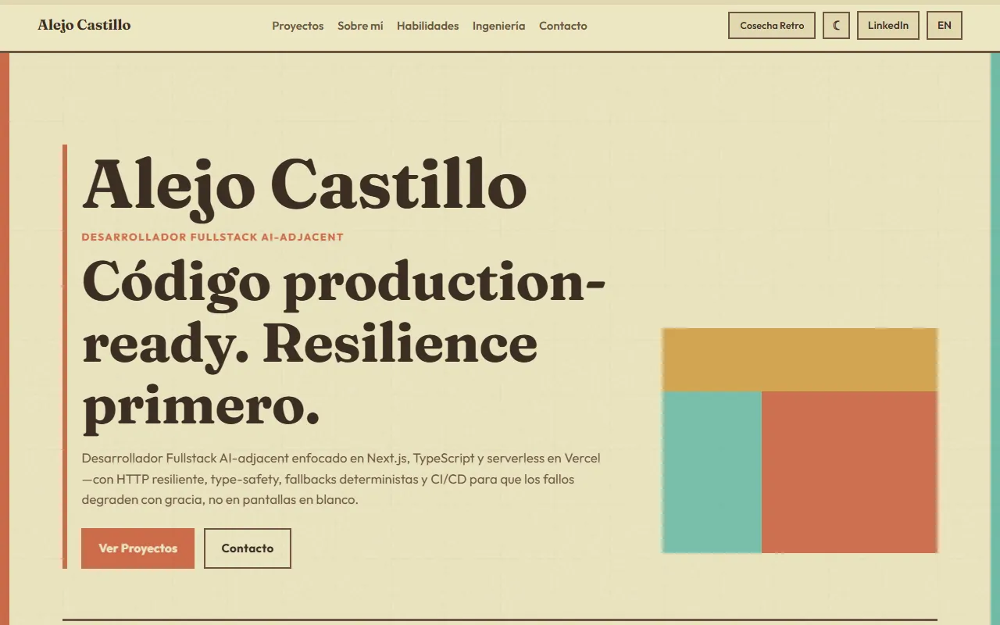

# Portfolio 2.0: Alejo Castillo

[](https://portfolio-sooty-nu-bjae97llpm.vercel.app/)

Personal site and project hub. Case studies, bilingual EN/ES UI, Next.js + GSAP.

**Live:** [portfolio-sooty-nu-bjae97llpm.vercel.app](https://portfolio-sooty-nu-bjae97llpm.vercel.app/)



## Stack

| Layer | Tech |
|-------|------|
| Framework | Next.js 15 (App Router), TypeScript, React 19 |
| Motion | GSAP + ScrollTrigger |
| Theme | `next-themes` + aesthetic packs |
| Fonts | Fraunces (display) + Outfit (sans) via `next/font` |
| Hosting | Vercel |

## Features

- Bilingual EN/ES UI
- Scroll reveals for sections and project cards
- Case studies at `/projects/[slug]`
- Theme / aesthetic switcher
- Light / dark mode

## Run locally

```bash
npm install
npm run dev
```

```bash
npm run build
npm start
```

## License

See [LICENSE](./LICENSE).
